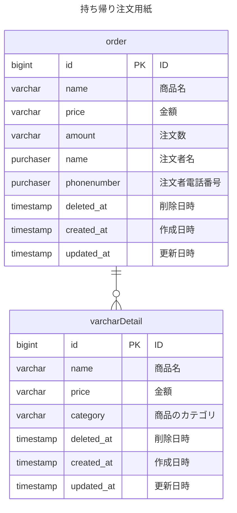

# ER図

## tweetデータベース

```mermaid
---
title: "持ち帰り注文用紙"
---
erDiagram
    order ||--o{ varcharDetail : ""

    order {
        bigint id PK "ID"
        varchar name "商品名"
        varchar price "金額"
        varchar amount "注文数"
        purchaser name "注文者名"
        purchaser phonenumber "注文者電話番号"
        timestamp deleted_at "削除日時"
        timestamp created_at "作成日時"
        timestamp updated_at "更新日時"
    }

    varcharDetail {
        bigint id PK "ID"
        varchar name "商品名"
        varchar price "金額"
        varchar category "商品のカテゴリ"
        timestamp deleted_at "削除日時"
        timestamp created_at "作成日時"
        timestamp updated_at "更新日時"
    }
```